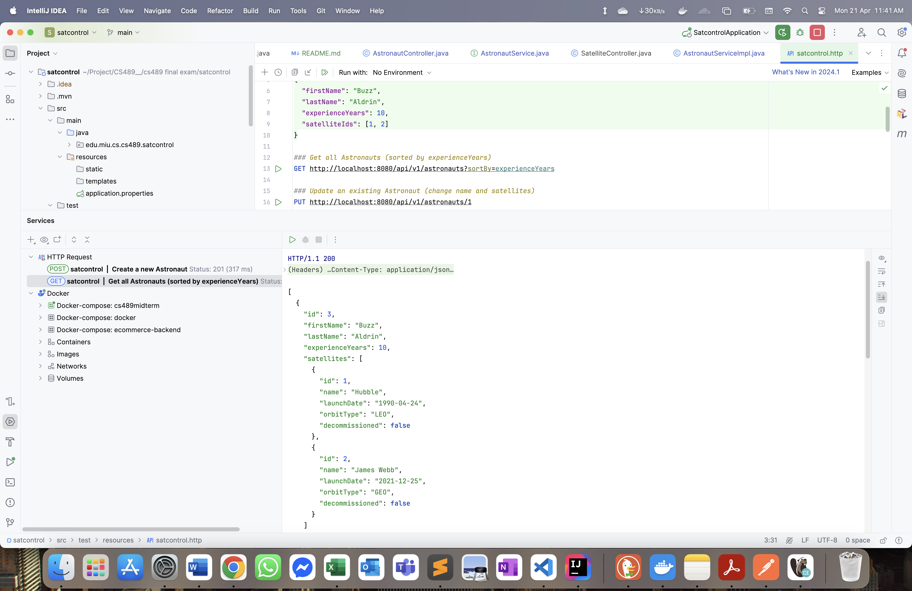
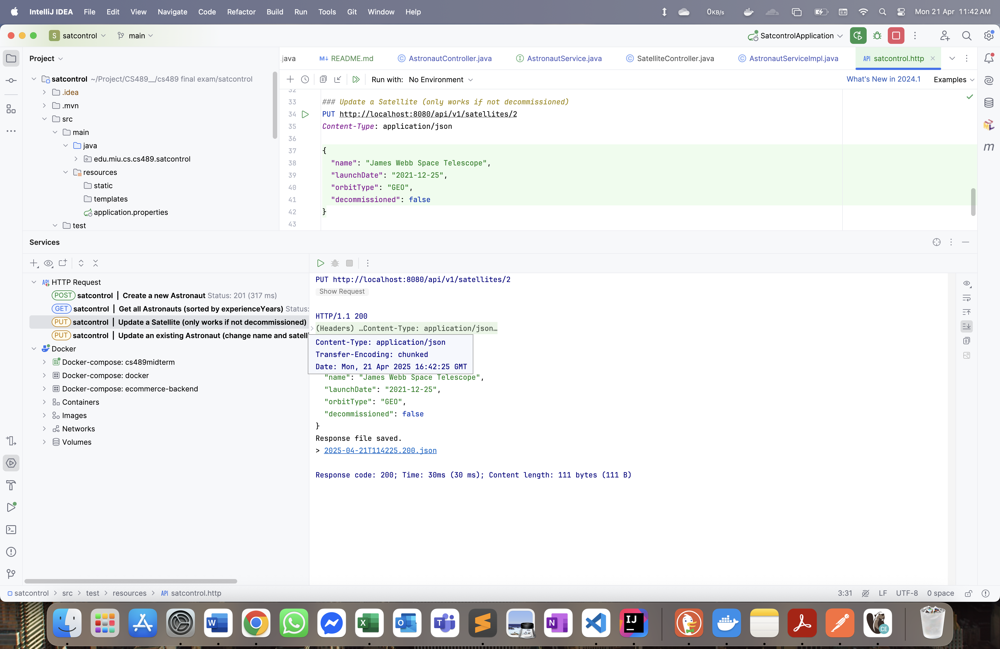
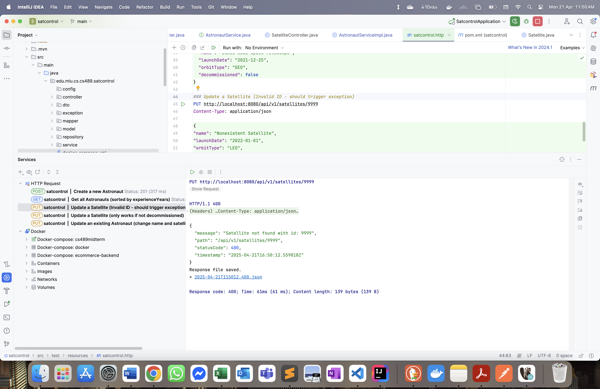

# CS489 Final Exam – Satellite Control System

A Spring Boot REST API for managing satellites and astronauts, built with Java 21 and PostgreSQL. Includes validation, pagination, DTOs, and Docker-based setup.

---

## Tech Stack

- Java 21
- Spring Boot 3.4.4
- Spring Data JPA
- Spring Validation
- PostgreSQL (via Docker)
- Lombok
- MapStruct
- Maven

---

## Project Structure
```
edu.miu.cs.cs489.satcontrol 
├── controller 
├── dto 
│ ├── request 
│ └── response 
├── exception 
├── mapper 
├── model 
├── repository 
├── service 
│ └── impl

```


---

## 🐳 Running with Docker

Start the PostgreSQL container:

```bash
docker-compose up -d

```

API Endpoints
-------------

### Astronauts

| Method | Endpoint | Description |
| --- | --- | --- |
| POST | `/api/v1/astronauts` | Create astronaut |
| GET | `/api/v1/astronauts` | Get all (sorted) |
| PUT | `/api/v1/astronauts/{id}` | Update astronaut |
| DELETE | `/api/v1/astronauts/{id}` | Delete astronaut |

### Satellites

| Method | Endpoint | Description |
| --- | --- | --- |
| GET | `/api/v1/satellites` | Get all satellites |
| PUT | `/api/v1/satellites/{id}` | Update satellite (if allowed) |


Screenshot:







